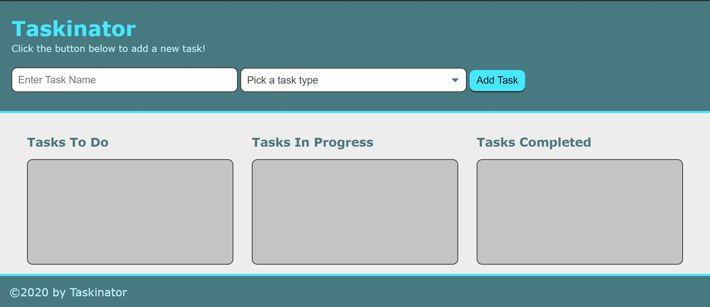

# The Taskinator

**My Repository does not have very many commit messages as I had been working and saving my work to an incorrect Repository and was not able to put the correct commit messages.**

Link to website: https://ktodoran.github.io/Taskinator/

This is a landing page for my first created Javascript file, the Taskinator!
If you need a simple wait to create, and keep track of different things you need to do, then this is for you!

On this landing page, you can create a new task you need to do, and move them from an "In Progress" section, to a "Task Completed" section once you have accomplished it!

There is a screenshot of the layout provided above! Feel free to take a look at its layout!

This file was created by me, Kyle Todoran!

If you have any suggestions or feel like something isn't quite working, shoot me an email at ktodoran@gmail.com! I would love some feedback!